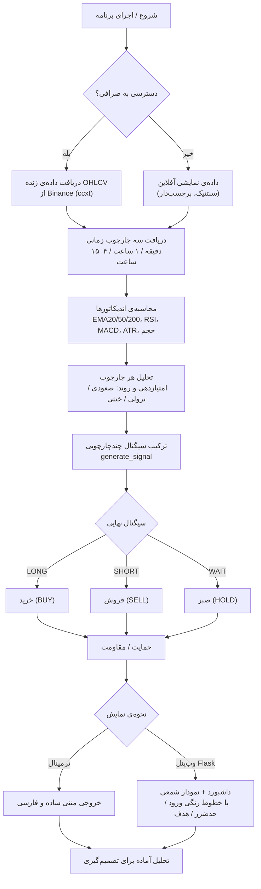

# AI Trader

تحلیلگر بازار کریپتو: داده (صرافی / فایل خودت / دمو)، اندیکاتورها، **تحلیل اخبار با مدل AI محلی**،
گیت‌های ریسک، ژورنال دقت سیگنال، بک‌تست چندتایم‌فریمه، بهینه‌ساز پارامتر و یک وب‌پنل زنده.

> ⚠️ این یک ابزار پژوهشی/آموزشی است، نه توصیه مالی. هیچ‌وقت با پولی که به آن نیاز داری معامله نکن؛
> بک‌تست‌ها روی داده‌ی تاریخی‌اند و آینده را تضمین نمی‌کنند.

---

## نصب

```bash
git clone <this repo> && cd ai-trader
python -m venv .venv
source .venv/bin/activate          # ویندوز: .venv\Scripts\activate
pip install -r requirements.txt
```

اختیاری — اگر می‌خواهی کلید API یا پروکسی را از محیط بگیریم:

```bash
cp .env.example .env               # ویندوز: copy .env.example .env
```

هیچ سرویسی برای اجرای پایه لازم نیست: اگر اینترنت یا صرافی در دسترس نباشد، برنامه با
**داده‌ی دمو آفلاین** و **تحلیل‌گر واژگانی (lexicon) اخبار** کار می‌کند و وضعیت را روی
پنل اعلام می‌کند.

## اجرای سریع

```bash
python main.py                     # سیگنال برای نماد تنظیم‌شده، خروجی فارسی در ترمینال
python main.py panel               # وب‌پنل روی http://127.0.0.1:5000
python main.py signal --symbol SOL --tf 1h --json
python main.py news                # فقط امتیاز اخبار
python main.py backtest --plot     # بک‌تست روی همان منبع داده
python main.py journal             # دقت سیگنال‌هایی که ثبت شده
python main.py settings            # تنظیمات فعلی
```

`--offline` همه‌چیز را روی داده‌ی دمو و بدون شبکه می‌برد (برای دیدن رابط کاربری مناسب است).
گزینه‌های `--symbol/--tf/--source/--csv` فقط برای **همان اجرا** هستند و در فایل تنظیمات ذخیره نمی‌شوند.

---

## ۱) تحلیل اخبار با AI محلی

هدف این است که تیترهای واقعی، **معنا‌شناسی** شوند (نه فقط شمارش کلمات)، اما هیچ داده‌ای از
ماشین تو بیرون نرود. مدل می‌تواند روی لپ‌تاپ خودت اجرا شود.

### با Ollama (ساده‌ترین راه)

```bash
# نصب: https://ollama.com/download
ollama pull llama3.1:8b            # یا هر مدل متنی دیگر، مثلاً qwen2.5:7b
ollama serve                       # معمولاً خودش به‌صورت سرویس اجراست
```

بعد در وب‌پنل: `Settings → News`

| کلید | مقدار پیشنهادی | توضیح |
| --- | --- | --- |
| `news_enabled` | `true` | کل بخش اخبار خاموش/روشن |
| `news_provider` | `ollama` | `ollama` (محلی) · `openai` (هر سازگار با OpenAI) · `lexicon` (آفلاین) · `off` |
| `ollama_url` | `http://127.0.0.1:11434` | آدرس سرویس |
| `ollama_model` | `llama3.1` | باید قبلاً `pull` شده باشد |
| `llm_timeout` | `45` | ثانیه؛ بعد از آن lexicon جای مدل را می‌گیرد |
| `llm_batch_size` | `12` | تعداد تیتر در هر درخواست (مدل‌های کوچک‌تر = عدد کمتر) |
| `llm_max_tokens` | `700` | سقف پاسخ |
| `llm_temperature` | `0` | برای قضاوت عددی، صفر |
| `news_veto_mode` | `downgrade` | `off` فقط نمایش · `downgrade` سخت‌کردن آستانه · `block` رد کردن معامله خلاف news |
| `news_veto_threshold` | `0.55` | شدت اخبار مخالف که باعث واگو می‌شود |
| `news_extra_keywords` | `{}` | واژه‌های اختصاصی هر نماد، مثل `{"TAO": ["Bittensor", " subnet"]}` |

دکمهٔ **Test** در همان تب، سه تیتر نمونه را واقعاً به مدل می‌دهد و امتیاز/دلیل هرکدام را نشان
می‌دهد؛ اگر مدل بالا نباشد، پیام می‌گوید چه دستوری را اجرا کنی و تحلیل با lexicon ادامه پیدا می‌کند.

### با LM Studio / vLLM / llama.cpp / سرور OpenAI

`news_provider = openai` و بعد:

```bash
python main.py settings set openai_base_url http://127.0.0.1:1234/v1
python main.py settings set openai_model llama-3.1-8b-instruct
# فقط برای سرویس‌های دور: AI_TRADER_OPENAI_API_KEY را در محیط بگذار (یا .env)
```

### چه خبرهایی خوانده می‌شود؟

- چهار فید RSS پیش‌فرض (CoinDesk، Cointelegraph، Decrypt، Bitcoin Magazine) — با `rss_feeds` قابل تغییر/افزودن
- در صورت فعال‌بودن: CryptoPanic (`cryptopanic_enabled` + `cryptopanic_token`) و شاخص ترس و طمع
- هر تیتر مرتبط با نماد وزن بیشتری می‌گیرد (`symbol_relevance_only`) و تازگی با `recency_half_life_hours` محاسبه می‌شود
- نتایج در `data/cache/` ذخیره می‌شوند (`news_cache_ttl` به ثانیه)؛ اگر شبکه قطع باشد، آخرین
  تحلیل معتبرِ منقضی‌شده مصرف می‌شود و روی کارت برچسب `stale` می‌خورد

اگر `news_enabled` روشن باشد ولی هیچ خبری به دست نیاید، امتیاز اخبار **صفر** نمی‌شود:
وزنش از مجموع حذف می‌شود و بقیهٔ اجزا دوباره نرمال می‌شوند (در جدول شکست امتیاز، ردیف
`News & AI sentiment` با برچسب «data unavailable — weight dropped» دیده می‌شود).

---

## ۲) تحلیل روی دادهٔ خودت

سه منبع داده وجود دارد (`data_source`): `auto` (صرافی → CSV → دمو)، `exchange`، `csv`، `demo`.

### قالب CSV

یک فایل متنی با سرتیتر؛ ترتیب ستون‌ها مهم نیست و نام‌های رایج هم شناخته می‌شوند
(`time/date/datetime`، `vol/assets`، `close/Close…`):

```csv
timestamp,open,high,low,close,volume
2026-01-01 00:00:00,42100.1,42350.0,42050.7,42310.4,118.7
2026-01-01 00:15:00,42310.4,42480.2,42290.0,42455.9,95.2
```

- ستون‌های `open/high/low/close` لازم‌اند؛ `volume` اختیاری (بدون آن حجم خنثی می‌شود و
  اجزای وابسته به حجم وزنشان را از دست می‌دهند — عمداً، تا سیگنال از دادهٔ غیرواقعی ساخته نشود)
- حداقل ۳۰ کندل لازم است؛ تایم‌فریم از فاصلهٔ زمانی خودِ داده حدس زده می‌شود
  (و با `csv_timeframe` قابل اجبار است). تایم‌فریم‌های **بزرگ‌تر** از داده به‌صورت
  OHLCV resample می‌شوند؛ کوچک‌تر از داده ساخته نمی‌شود
- تاریخ‌ها می‌توانند naive (یوتی‌سی فرض می‌شود) یا tz-aware باشند

### از وب‌پنل

`Settings → Data → Your own CSV` → انتخاب فایل → **Upload & use**. بعد از آن نمودار، سیگنال،
بک‌تست و بهینه‌ساز همه روی همان فایل اجرا می‌شوند (برچسب `CSV` در نوار بالا). با
`Use exchange/auto data` به حالت قبل برمی‌گردی. فایل‌ها در `data/uploads/` می‌مانند (این پوشه
در `.gitignore` است).

### از خط فرمان

```bash
python main.py signal --csv data/uploads/my-btc.csv --tf 1h
python main.py backtest --csv data/uploads/my-btc.csv --export out.csv --plot equity.png
```

### صرافی

`exchange_id` (پیش‌فرض `binance`)، `symbol` مثل `BTC/USDT`، `quote` و در صورت لزوم `proxy_url`.
اگر صرافی پاسخ ندهد، خطا در `/api/health` و پایین کارت داده نمایش داده می‌شود و برنامه
به CSV/دمو برمی‌گردد — صفحه هرگز سفید نمی‌ماند.

---

## ۳) تنظیمات

۱۵۰ کلید در ۱۰ گروه، از چهار راه — همهٔ آن‌ها به یک‌جا می‌نویسند:

| راه | مثال |
| --- | --- |
| وب‌پنل | `Settings` (هر گروه یک تب؛ اسلایدر/سوئیچ/فهرست؛ دکمهٔ Save، Reset، Export، Import) |
| CLI | `python main.py settings show --all` · `settings get rsi_period` · `settings set atr_stop_multiplier 2.2` · `settings reset` |
| فایل | `data/settings.json` (مقادیر غیرپیش‌فرض؛ هر مقدار خارج از بازه رد می‌شود و فایل دست‌نخورده می‌ماند) |
| محیط | پیشوند `AITRADER_` — `AITRADER_RISK_PER_TRADE=0.02`، `AITRADER_SETTINGS_FILE=/path/to.json` |

مهم‌ترین‌ها:

- **اندیکاتورها**: `ema_fast/mid/slow`، `rsi_period`، `macd_fast/slow/signal`، `atr_period`،
  `adx_period`، `bb_period/bb_std`، `supertrend_period/multiplier`، `mfi_period`، `cci_period`
- **استراتژی**: `entry_threshold`، `neutral_threshold`، `min_confidence`، `require_trend_alignment`،
  `require_macd_cross`، `require_volume_confirm`، `require_structure_agreement`، `allow_longs/allow_shorts`،
  `pullback_distance`، `min_volume_ratio`، `max_overextension_pct`، `max_atr_ratio`، `min_bars_between_signals`
- **وزن‌ها**: `weight_trend/momentum/volume/structure/alignment/volatility/levels/news/derivatives/micro/cross_asset`
  (لازم نیست جمعاً ۱۰۰ شوند — نرمال می‌شوند) و `weight_mode = manual | adaptive`
- **ریسک**: `initial_balance`، `risk_per_trade` (کسری، مثلاً `0.01` = یک درصد)، `leverage`،
  `stop_mode = atr | structure | hybrid`، `target_mode = atr | structure | rr`، `tp1_r/tp2_r`،
  `min_risk_reward`، `taker_fee`، `slippage`، `maintenance_margin`
- **ژورنال**: `journal_enabled`، `journal_eval_after_candles`، `journal_touch_tolerance`
- **بک‌تست/بهینه‌ساز**: `backtest_candles`، `optimizer_trials/mode/objective/ranges/train_ratio/seed`
- **رابط**: `ui_language`، `ui_refresh_seconds`، `ui_show_persian_help`، `ui_chart_overlay_*`

هر تغییر، از لحظهٔ بعد در تحلیل زنده و در بک‌تست اعمال می‌شود؛ چیزی «فقط ظاهری» نیست.

### وزن‌های خودتنظیم

هر سیگنال در `data/logs/signals.jsonl` ثبت می‌شود و بعد از `journal_eval_after_candles` کندل،
بر اساس همان داده داوری می‌شود (حد ضرر خورد؟ TP1 خورد؟ چقدر R؟). با `weight_mode = adaptive`
مجموعه‌ی وزن‌ها بر پایهٔ همبستگی (IC) هر جزء با بازده واقعی تنظیم می‌شود؛ تا نمونه‌های کم باشند
(`adaptive_min_samples`، کف ۵) همان وزن‌های دستی می‌مانند و تب Journal توضیح می‌دهد چند نمونه لازم است.

---

## ۴) بک‌تست و بهینه‌ساز

```bash
python main.py backtest                       # خلاصه + نمودار equity در ترمینال
python main.py backtest --export trades.csv --plot equity.png
python main.py optimize --trials 20           # walk-forward
python main.py optimize --trials 20 --apply   # بهترین حالت را در تنظیمات ذخیره کن
```

- موتور بک‌تست همان گیت‌ها، همان حد ضرر/هدف و همان مدل کارمزد/اسلیپیج/فاندینگ تحلیل زنده را
  استفاده می‌کند (نه یک نسخهٔ ساده‌شده)
- `optimize` داده را به دو بخش train/test تقسیم می‌کند و فاصلهٔ نمرهٔ این دو را به‌عنوان
  **نشانهٔ بیش‌برازش** نشان می‌دهد؛ اگر `|overfit gap| > 40` باشد هشدار می‌دهد
- `optimizer_ranges` را می‌توانی در صفحهٔ تنظیمات به شکل JSON یا باز پر کنی:
  `{"entry_threshold": [20, 30, 40], "min_confidence": {"min": 30, "max": 60, "step": 15}}`
- کلیدهای `backtesting/optimizer.py` فقط روی کلیدهای واقعی تنظیمات اجرا می‌شوند؛ مقدار نامعتبر
  ذخیره نمی‌شود

## ۵) ساختار پروژه

```text
main.py                ورودی خط فرمان (signal · news · backtest · optimize · journal · settings · panel)
config/                تعریف ۱۵۰ کلید، اعتبارسنجی، ذخیره، import/export، override از محیط
data/                  منبع داده (صرافی/CSV/دمو)، کش، آپلودها
analysis/              اندیکاتورها، امتیازدهی، اخبار، مشتقات، میکروساختار، گیت‌ها، سطوح، ریسک، ژورنال
backtesting/           موتور، چندتایم‌فریمه، معیارها، بهینه‌ساز، خروجی
webapp/                Flask: قالب‌ها + API + JS (نمودار، تنظیمات، بک‌تست)
webapp/static/src/     ورودی Tailwind (تم و کامپوننت‌ها) — خروجی‌اش build می‌شود
reports/               ساخت گزارش و نمودار
tests/                 ۲۳۳ تست، آفلاین و بدون نیاز به شبکه
```

### رابط کاربری (Tailwind)

قالب‌های وب‌پنل با **Tailwind CSS v4** نوشته شده‌اند؛ دیگر فایل `style.css` دستی نداریم.

```text
webapp/static/src/tailwind.css   منبع: @theme (رنگ‌های تم)، @layer base، @layer components
webapp/static/tailwind.css       خروجی build (کامیت شده — برای اجرا Node لازم نیست)
```

ساخت دوباره بعد از تغییر کلاس‌ها در قالب‌ها یا JS:

```bash
npm install            # فقط بار اول
npm run css            # build یک‌باره (minified)
npm run css:watch      # در حین توسعه
```

تم (رنگ‌ها، فونت) در `@theme` داخل فایل منبع است و قطعات تکراری (`.card`، `.btn`، `.chip`،
`.tbl`، `.field`، `.probe` و…) در `@layer components` با `@apply` تعریف شده‌اند تا مارک‌آپ
production که JS در لحظه می‌سازد (نتیجهٔ probeها، جدول بهینه‌ساز، دراپ‌داون نمادها) هم همان
ظاهر را داشته باشد. خروجی کامیت می‌شود چون پنل باید بدون Node و آفلاین هم بالا بیاید.

### API های وب‌پنل

| مسیر | کاربرد |
| --- | --- |
| `GET /` · `/settings` · `/backtest` · `/journal` | صفحات |
| `GET /api/signal?symbol=&full=0` | کامل‌ترین خروجی تحلیل (امتیازها، گیت‌ها، اخبار، setup) |
| `GET /api/analysis?symbol=` | خلاصهٔ هر تایم‌فریم |
| `GET /api/candles?symbol=&tf=` | کندل‌ها + لایه‌های محاسبه‌شدهٔ سرور |
| `GET /api/news` · `/api/derivatives` | فقط امتیاز اخبار / مشتقات |
| `GET /api/backtest?symbol=&trades=0` · `POST /api/journal/evaluate` | بک‌تست · بستن سیگنال‌های باز |
| `GET/POST /api/settings` · `POST /api/settings/reset` | خواندن/نوشتن تنظیمات |
| `GET /api/settings/export` · `POST /api/settings/import` | جابه‌جایی تنظیمات بین ماشین‌ها |
| `POST /api/settings/test/news|llm|data` | تست اتصال اخبار، مدل محلی و منبع داده |
| `POST /api/data/upload` · `POST /api/data/use` · `GET /api/data/files` | دادهٔ خودت |
| `POST /api/backtest/optimize` · `/api/backtest/apply` | بهینه‌سازی و اعمال نتیجه |
| `GET /api/health` | منبع داده، فایل تنظیمات، تعداد کندل |

## ۶) تست‌ها

```bash
python -m unittest discover -s tests      # ۲۳۳ تست، کاملاً آفلاین
```

## عیب‌یابی

| علامت | راه‌حل |
| --- | --- |
| `Chart library failed to load (offline?)` | کتابخانهٔ نمودار از CDN می‌آید؛ اینترنت را وصل کن یا `lightweight-charts.standalone.production.js` را در `webapp/static/` بگذار و مسیر تگ `script` را محلی کن |
| `connection refused` در تست Ollama | `ollama serve` و بعد `ollama pull llama3.1:8b`؛ آدرس/پورت را در تنظیمات ببین |
| مدل جواب می‌دهد ولی امتیاز اخبار خنثی است | `llm_timeout` را زیاد کن یا `llm_batch_size` را کم کن؛ خروجی Test دقیقاً همان چیزی که مدل گفته نشان می‌دهد |
| صرافی تایم‌اوت می‌شود | `proxy_url` را ست کن، یا `data_source = csv/demo` |
| CSV خوانده نشد | ستون‌های open/high/low/close یا ستون زمان اشتباه است، یا کمتر از ۳۰ کندل داری، یا تایم‌فریم خواسته‌شده ریزتر از داده است |
| سیگنال همه‌جا WAIT است | `entry_threshold` بالا یا `min_confidence` سخت‌گیرانه است؛ تب Backtest را با همان تنظیمات اجرا کن و `total_trades` را ببین |
| خواسته شد تنظیمات به حالت اول برگردد | `python main.py settings reset` (فایل `data/settings.json` پاک می‌شود) |

---

## فلوچارت تحلیل

مسیری که برنامه طی می‌کند تا از داده‌ی خام به «خرید / فروش / صبر» برسد:


